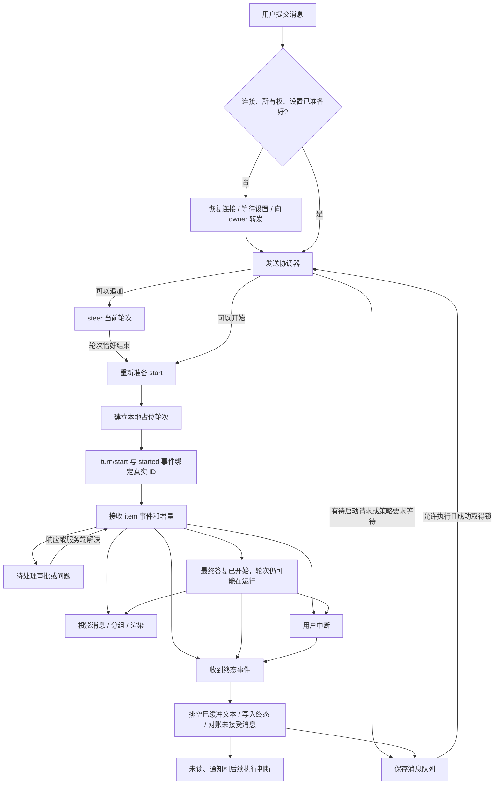

# Codex 桌面端：任务执行与显示规则提取

这份文档把本机客户端的一条任务从提交、执行、追加消息、等待用户、中断、完成到重新打开，整理为可以用于实现和验收的行为规则。来源是实际安装包中的 JavaScript 条件分支，不是凭界面印象推测。

分析日期：2026-09-05。安装包：`/Applications/ChatGPT.app/Contents/Resources/app.asar`；包名：`openai-codex-electron`；包内版本：`26.901.41600`。

## 阅读入口

- [组件树、参数与交互](components/README.md)：补充 52 个组件函数的结构、输入输出与内部交互规则。
- [执行控制规则](execution.md)：提交、消息排队、流式事件、审批、问题、中断和通知。
- [具体显示规则](presentation.md)：最终答复、活动分组、思考状态、折叠、计时、图片与计划。
- [恢复与滚动规则](recovery-and-scroll.md)：重开任务、历史分页、阅读位置和返回底部。
- [验证与验收场景](validation.md)：已执行的函数探针、仍需 UI 验证的场景、覆盖边界。
- [代码证据索引](evidence.md)：每组规则对应资源文件、函数和精确偏移；[机器可读索引](evidence.json)另含 SHA-256。

## 核心发现

不能用一个 `isLoading` 同时驱动所有交互。客户端至少分别判断：轮次是否仍在执行、最终答复是否已经开始、是否存在待处理请求、消息是否已被服务器接受、是否有待启动消息、过程是否允许折叠、用户是否正在读旧内容。

例如，“开始最终回答”可能让工作计时停止、让过程允许折叠，也可能让下一条用户消息转入队列；此时原轮次仍然是 `inProgress`。而协议中的 `failed` 在展示投影中也映射成 `complete`，错误信息由其他字段和条目表达。[E01](evidence.md#e01)、[E10](evidence.md#e10)、[E31](evidence.md#e31)、[E34](evidence.md#e34)

下面是对已找到分支的概括图，节点名是本文的解释性命名，并非原程序完整枚举：

图中的“结果未知”是另一条重要异常路径：提交请求可能已到服务器，但客户端没有得到确认。代码保留未确认提交记录，不能把它简单等同于“发送失败，可以立即重发”。[E02](evidence.md#e02)、[E08](evidence.md#e08)

## 如何把这些规则用于自己的产品

以下是依据已观察行为给 Marloues 的设计建议，不是声称原客户端使用了完全相同的类型或模块名：

1. 建立事件记录与状态更新层：按 `threadId / turnId / itemId / requestId / clientUserMessageId` 对账，保留运行、提交和连接状态各自的含义。
2. 建立展示投影层：把协议条目转成用户消息、过程活动、最终回答、待处理请求和产物；不在每个组件里独立猜测。
3. 建立显示决策层：统一计算指示器、折叠、计时、队列入口与产物占位，组件只负责呈现和交互。
4. 用事件序列回放验收：特别覆盖“发送后马上结束”“中断后晚到事件”“问题已在其他窗口回答”“用户上翻时流式增长”。

最有价值的复刻对象是这些决策及其输入字段。颜色、间距和动画仍需要实际界面对照；函数条件本身无法证明最终视觉完全一致。

## 可信度与边界

- **静态确认**：规则表的来源都能定位到本机此版本的条件、数据处理或调用点；可复核，但不代表每个功能开关在你的账号上都开启。
- **函数探针**：另外直接执行了选取的原始纯函数，验证边界输入；具体数量和结果见验证文档。
- **尚未验证**：没有执行真实发消息、中断、审批或修改官方客户端的 UI 自动化。后台协议实现、灰度参数、云任务、语音和另一种会话呈现分支不能仅凭本次分析认定全部覆盖。

这里的“完整”指普通本地任务的端到端主流程已经串起来，不是宣称已穷举整个客户端的每一个分支。未覆盖内容明确列在验证文档中。正文是分析结论；没有把整份官方前端源码复制进仓库。

公开协议另可参考 [OpenAI 的 App Server 文档](https://learn.chatgpt.com/docs/app-server)。本报告中队列、折叠、计时与滚动的细节证据来自本机资源包，不能把这些 UI 规则归为公开协议保证。
