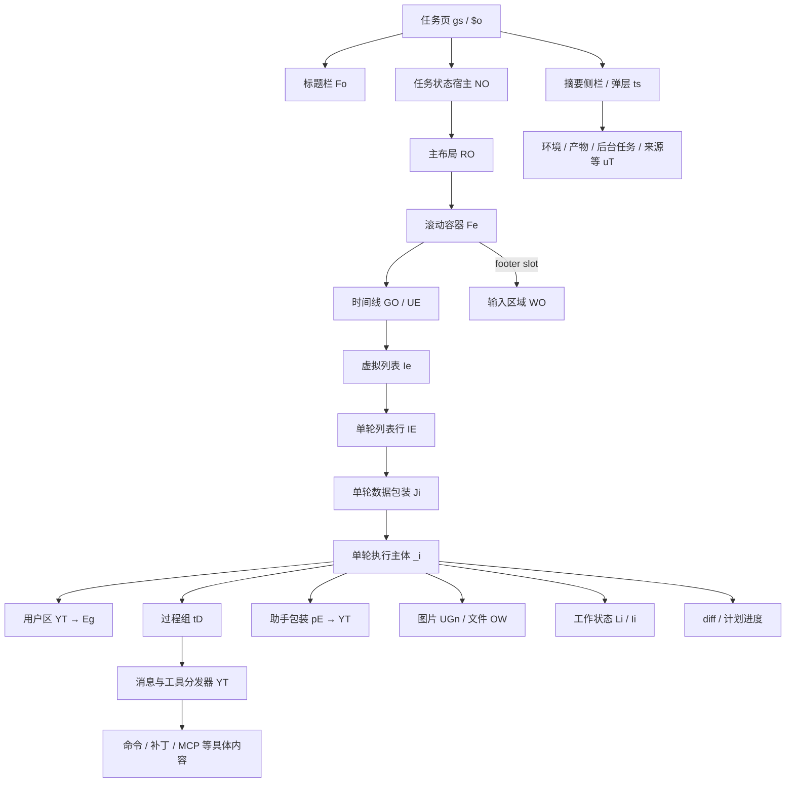
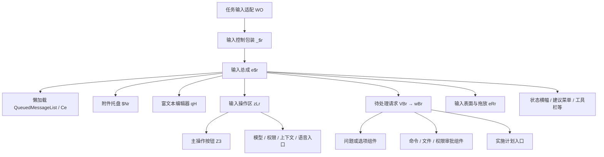

# Codex 组件树、参数与交互

本次继续分析同一个安装包 `openai-codex-electron 26.901.41600`。组件层整理了 **52 个组件函数、40 条交互规则、35 组证据、57 个代码定位，涉及 17 个资源文件**。它们覆盖任务页、消息时间线、执行过程、输入区域和任务摘要面板。

这里交付的是组件结构与行为规格。中文组件名是为阅读添加的标签；`Eg`、`YT`、`e$r` 等是该版本资源里的真实压缩符号。除 `LocalConversationPage`、`QueuedMessageList` 等仍保留的导出名外，不能把这些中文名当作恢复出的原始源码命名。

- [对话区独立规格](conversation-area.md)：只看消息列表、单轮内容、执行过程与产物的组件树、参数、显示规则和滚动交互。
- [转换为 Marloues 的适配规格](../../marloues-conversation-area.md)：对应项目真实组件，区分现有行为、待接线组件、目标规则和数据缺口。
- [参数与职责表](contracts.md)：组件接收什么、向外通知什么、承担什么职责。
- [组件交互规则](interactions.md)：hover、编辑、复制、折叠、禁用反馈、焦点和队列操作。
- [代码证据](evidence.md)：真实文件、符号与精确偏移。
- [机器可读目录](catalog.json)：提取到的参数名、直接 JSX 子组件引用、import/export 映射。

## 页面与时间线组件树

下图沿源码里的调用和 slot 传递关系归纳，省略多数 Provider、图标、国际化文本及条件包装器。它不是某一时刻 DevTools 抓到的完整 DOM 树；图上多个分支也不一定同时可见。



来源：[C01–C09](evidence.md#c01)、[C29](evidence.md#c29)、[C30](evidence.md#c30)、[C35](evidence.md#c35)。C01–C09 的逐项定位见证据目录。

两个关键分工：

1. `Ji` 把原始轮次、请求、历史身份和配置整理好，再交给 `_i`。`_i` 决定用户区、过程区、最终答复和产物的组合。
2. `YT` 是按 item 类型分发的共用渲染器。用户消息、工具活动和最终答复会在不同上下文中经过它，不能把它理解成一个固定的“聊天气泡”。

## 输入区域组件树



来源：[C20–C28](evidence.md#c20)。`mfr` 是资源包中懒加载队列组件的别名，实际目标为 `queued-message-list-2fae7464065e.js` 的 `QueuedMessageList` 导出。`eRr` 作为输入总成调用的子组件记录在目录中，本次没有单独穷举它的样式变体。

输入框不是一个 textarea 外面加几个按钮：

- `qH` 挂接 `composerController.view.dom`，管理焦点、输入法组合状态、mention/link 交互及可访问标签。
- `zLr` 决定显示发送、追加、排队、停止或恢复入口，还根据测量宽度安排辅助控件。
- `Z3` 管理按钮自己的 loading、禁用语义、快捷键提示及阻塞原因反馈。
- `VBr / wBr` 接管需要回答或审批时的专门输入界面。

## 参数怎样影响组件

| 参数类别 | 真实字段示例 | 应保留的含义 |
|---|---|---|
| 身份 | `conversationId`、`hostId`、`turnId`、`historyEntityKey`、`turnSearchKey` | 消息、请求、历史实体与执行主机的关联，不只是 React key。 |
| 执行状态 | `isTurnInProgress`、`isResponseInProgress`、`isResuming`、`isStopping` | 不能合并成一个 loading。 |
| 内容状态 | `item`、`turn`、`turnRequests`、`images`、`pendingImageCount` | 分别描述内容、请求和尚未完成产物。 |
| 呈现策略 | `conversationDetailLevel`、`renderMcpApps`、`showFullTranscript`、`deferOffscreenDiffRendering` | 决定渲染方式或是否延后绘制，不能改变事实数据。 |
| 交互选择 | `isCollapsed`、`persistedCollapsed`、`editingMessageId`、`forceExpanded` | 用户选择与自动默认值各有优先级。 |
| 输出事件 | `onSetCollapsed`、`onEditMessage`、`onForkTurn`、`onSendNowMessage`、`onSubmit` | 组件把动作交给上层；上层负责异步执行和结果对账。 |
| 布局接口 | `latestTurnFollowContentRef`、`onViewportChange`、`onResponseSpacerStateChange` | 新回复放置和滚动保持需要跨组件协调。 |

很多组件也从 scope、query、context 或 controller 读取状态。资源包保留的 props 名不能替代这些依赖，更不能自动还原原始 TypeScript 类型、所有必填项或完整默认值。

## 如何复核

在本目录执行：

```sh
node ../inspect-bundle.mjs --index evidence.json verify
node ../inspect-bundle.mjs --index evidence.json show C25 --full
```

组件证据单独存放，不改变上一阶段 110 条执行与显示规则的计数。原有 59 个函数探针也不应算作这 52 个 React 组件已经通过 UI 测试。

本次验证：17 个资源文件与 57 处代码片段的哈希全部匹配；组件目录的身份、来源范围和 JSX 调用范围已核对；扩展复核脚本后，原有 59 个判定函数探针仍全部通过。

本次做了静态参数、引用和代码定位核对，没有挂载这些官方组件，没有改变 Marloues 产品代码。全局导航、编辑器侧面板、设置页面、所有基础控件及各功能灰度分支尚未穷举。
