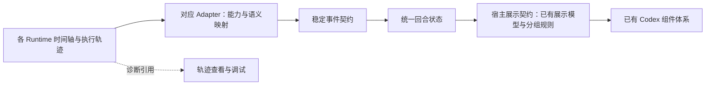

# Codex 对话渲染：现有组件接入审查

> 状态更新：本文保留审查阶段的基线分析（`edebdae`）。2026-09-05 已在独立工作树实施第一轮对话契约修复；当前改动、验证与未完成事项见 [实现记录](conversation-implementation-2026-09-05.md)。下文的缺陷描述和“未改产品代码”指审查阶段。

日期：2026-09-05。代码基线：`edebdae`。分支：`codex/architecture-review-20260905`。

## 目标与结论

用户已明确：产品需要 Codex 的对话渲染体验，已有的 18 个组件来自当初对 Codex 的逆向；不同 Runtime 通过能力接口和 Adapter 接入，未来换成自研 Runtime 时，体验仍然一致。因此本次方案以现有组件和交互契约为基线，重点检查接入路径、消息语义和状态推进。

用户进一步明确：**各 Adapter 的消息列表属于执行时间轴和轨迹，不能直接作为对话页面结构；页面应按宿主定义的契约展示。** 原始记录、规范化后的回合状态、用于组件装配的展示模型需要各自明确职责。把字段改成统一类型名，或者把每条轨迹换成一个专用组件，都不足以满足这一约束。

按用户指定，已对照 GitHub 上的 DeepSeek Harness：其 Chat 与 Trajectory 分别注册事件规则和快照构建器，Chat 最终只分发已装配的展示节点。[DSH 源码参考与本项目落点](/Users/xuzong/workspace/marloues-architecture-review-20260905/docs/architecture/dsh-reference-2026-09-05.md) 记录了固定提交、调用链与借鉴范围。

**已确认的主要断点：实际页面绕过了已有的展示模型与专用组件链路；简化后的渲染器不覆盖完整消息类型；上游又混用了消息语义和事件生命周期。** 这足以解释为什么已有组件仍在，实际对话却呈现另一种模式。

这是源码、Git 历史和离线函数执行得出的结论，尚未进行实际 Electron/Codex 界面的视觉对照。本次只修改审查材料与诊断探针，未改产品代码。

## 1. 资产仍在，入口已被替换

本地契约明确记录来源 `codex-desktop`，版本 `26.803.10989`，并保存用户消息宽度、活动区最大高度、折叠时长、底部锁定阈值、滚动条和输入框参数：

- [conversation-page-contract.ts](/Users/xuzong/workspace/marloues-architecture-review-20260905/client/shared/conversation-page-contract.ts)
- [codex-activity-contract.ts](/Users/xuzong/workspace/marloues-architecture-review-20260905/client/renderer/src/components/workflow-chat/activity/codex-activity-contract.ts:29)：活动分组、显隐、状态摘要、工具标题和包装事件过滤规则。
- [三层契约](/Users/xuzong/workspace/marloues-architecture-review-20260905/docs/architecture/three-layer-contract.md)：已经写明 UI 复用逆向组件，只消费稳定协议，Runtime 可替换。

这些是项目已有的参考基线，不能据此宣称与当前 Codex 最新版本完全相同。

实际页面链路为：

```text
WorkflowChatPage
  → ReadThreadTurnList
  → WorkflowTurnView
  → 展开：items.map(MessageItemView)
    折叠：最后一条非空 agentMessage
```

入口证据：[WorkflowChatPage](/Users/xuzong/workspace/marloues-architecture-review-20260905/client/renderer/src/pages/WorkflowChatPage.tsx:862)、[ReadThreadTurnList](/Users/xuzong/workspace/marloues-architecture-review-20260905/client/renderer/src/components/workflow-chat/turns/ReadThreadTurnList.tsx:130)、[TurnView](/Users/xuzong/workspace/marloues-architecture-review-20260905/client/renderer/src/components/workflow-chat/turns/TurnView.tsx:103)。普通列表入口 `WorkflowTurnList` 也使用同一个 `WorkflowTurnView`。

仍保留在仓库中的完整链路为：

```text
WorkflowTurnView
  → buildTurnPresentationModel
  → WorkflowAssistantTurn / WorkflowTurnShell
  → TurnPresentationBlocks
      → process：活动分组、过程说明、专用活动组件
      → document：最终答复 / 错误
      → results：文件变更、图片、预览
```

生产代码中 `buildTurnPresentationModel`、`WorkflowAssistantTurn` 只剩定义及导出，相关测试会直接调用它们。主页面没有经由这条完整链路。

Git 历史进一步定位了改变：`5d1acb1` 中 `TurnView` 调用展示模型并装配 `WorkflowAssistantTurn`；`e1cd719`（2026-08-17，`feat(ui): message view, steer controls and turn rendering updates`）删除这两处调用，改用 `MessageItemView` 和自行计算的摘要。该提交还包含其他功能，修复时应只调整相关链路，保留经过验证的引导消息、流式稳定性和长回合处理。

## 2. 逐类核对已有语义与组件

[WorkflowTurnItem](/Users/xuzong/workspace/marloues-architecture-review-20260905/client/shared/workflow-read-thread-contract.ts:180) 当前有 18 个联合类型成员：17 个已知类型和一个 `unknown`。以下按这 18 类核对已有实现；这是消息语义清单，组件间存在复用，不将它等同于已核实的 18 个独立 React 文件。

| 消息类型 | 已有组件或展示路径 | 当前主入口表现 |
| --- | --- | --- |
| userMessage | WorkflowUserMessage | 在 TurnView 单独显示 |
| agentMessage | WorkflowAssistantAnswer；过程说明与最终答复分开 | 通用 Markdown；忽略语义 phase |
| plan | WorkflowToolCallRow | 返回 null |
| reasoning | WorkflowReasoningRow；由活动契约决定显隐 | 替换为 MessageThinkRow |
| commandExecution | WorkflowCommandExecutionRow | 替换为通用工具行、IN/OUT |
| fileChange | WorkflowFileChangeRow / WorkflowResultCards | 通用工具行；未接入结果卡 |
| mcpToolCall | WorkflowToolCallRow | 通用工具行，复用部分详情 |
| dynamicToolCall | WorkflowToolCallRow；部分结果进入预览 | 通用工具行，复用部分详情 |
| collabAgentToolCall | WorkflowCollabAgentToolRow | 返回 null |
| webSearch | WorkflowWebSearchRow / WorkflowResultCards | 通用工具行；未接入结果卡 |
| imageView | WorkflowImageViewRow / WorkflowResultCards | 返回 null |
| imageGeneration | WorkflowImageGenerationRow / WorkflowResultCards | 返回 null |
| enteredReviewMode | WorkflowReviewModeMarker | 返回 null |
| exitedReviewMode | WorkflowReviewModeMarker | 返回 null |
| hookPrompt | WorkflowHookPromptBlock | 返回 null |
| permissionRequest | WorkflowPermissionRequestRow | 返回 null |
| contextCompaction | WorkflowContextCompactionMarker | 返回 null |
| unknown | WorkflowUnknownRawJson | 返回 null |

已有专用分发器 [TurnItemRenderer](/Users/xuzong/workspace/marloues-architecture-review-20260905/client/renderer/src/components/workflow-chat/activity/TurnItemRenderer.tsx:24) 对过程类型使用穷尽映射。是否默认显示、分组或进入结果区，由展示策略另行决定；不能把“有组件”理解成所有内容必须同时展开。

## 3. 具体问题与修复方案

### R1 / P1：主入口丢失 10 类助手侧内容

[MessageItemView](/Users/xuzong/workspace/marloues-architecture-review-20260905/client/renderer/src/components/workflow-chat/message-view.tsx:303) 只处理 agentMessage、reasoning、dynamicToolCall、mcpToolCall、webSearch、commandExecution、fileChange，其他类型落入 `return null`。用户消息已由上层处理，但其余 10 类没有同等补位。

触发条件是这些 canonical item 到达实际对话入口。图片、计划、子任务、审批过程等可能已经存在于数据中，页面仍不呈现；审批操作还有其他 UI 入口，本结论仅指对话内的记录与状态，不能外推为整个产品无法审批。

建议：恢复现有展示模型、专用分发器与结果卡在真实入口的装配；所有已知类型必须有明确的渲染或有理由的隐藏策略，未知类型按宿主契约降级并保留诊断引用。原始数据可供专门的轨迹查看与调试入口使用，对话页不能因转换失败而退回逐条渲染原始记录。继续使用已有组件与主题契约。

### R2 / P2：把最后一段文字当最终答复，过程折叠和复制语义失真

[TurnView](/Users/xuzong/workspace/marloues-architecture-review-20260905/client/renderer/src/components/workflow-chat/turns/TurnView.tsx:48) 折叠时只取最后一条非空 agentMessage；footer 却把所有 agentMessage 拼接为待复制文本。现有 [flow-helpers](/Users/xuzong/workspace/marloues-architecture-review-20260905/client/renderer/src/components/workflow-chat/turns/turn-layout/flow-helpers.ts:112) 已能识别 `commentary`、`final_answer`，却不在主入口路径内。

探针输入为“过程说明 → 明确标记的最终答复 → 后续过程说明”。当前折叠摘要显示后续过程说明，复制内容包含三段。这不是需要换一种 Markdown 样式的问题，而是展示角色未被使用。

此外，当前 [MessageStatusRow](/Users/xuzong/workspace/marloues-architecture-review-20260905/client/renderer/src/components/workflow-chat/message-view.tsx:450) 的状态文字固定为“正在思考”，已存在的具体工具状态、等待状态和分组摘要不能通过该行体现。

建议：由单一展示模型提供过程条目、最终答复和结果；折叠时根据既有契约收起过程，保留完整最终答复及结果入口。复制只消费该模型的最终答复文本。状态从规范化的运行状态及当前活动生成。组件维持稳定 ID，内容更新不应反复卸载 Markdown 或重置用户展开状态。

### R3 / P1：消息语义 phase 与事件生命周期 phase 混用

这也是为什么仅接回旧组件还不够：

1. [Codex normalize](/Users/xuzong/workspace/marloues-architecture-review-20260905/client/main/codex/normalize.ts:80) 把消息顶层 `phase` 写成事件生命周期 `started / updated / completed`；原始消息里的语义 phase 只留在 rawItem。
2. [canonical 转换](/Users/xuzong/workspace/marloues-architecture-review-20260905/client/shared/adapters/message-item-to-workflow-turn-item.ts:27) 继续把该生命周期值填入 agentMessage.phase，没有提取原始语义。
3. [WorkflowThreadStore.finalizeTurn](/Users/xuzong/workspace/marloues-architecture-review-20260905/client/main/core/runtime/workflow-thread-store.ts:769) 还会把尚未 settled 的 agentMessage.phase 改成 `finalized`。
4. 展示模型读取同名字段时，期待的却是 `commentary / final_answer / final`。

离线执行实际 normalizer 和 canonical converter，输入 `phase=final_answer`，输出得到 `phase=completed, settled=true`，语义丢失已复现。

建议：分开约束消息角色与生命周期。canonical 消息的 phase 只表达过程说明或最终答复；item 更新事件表达 started/updated/completed；settled 表达后续是否还会变化。收尾操作只改变状态和 settled，不覆盖消息角色。Adapter 原样映射 Runtime 提供的语义；原生不提供时保留“未指定”，统一兼容策略如需推断，应明确规则和来源，不能让各 UI 猜测 Runtime 的最后一段话。

### R4 / P2：测试验证了组件，未充分验证真实装配

[TurnPresentationBlocks 测试](/Users/xuzong/workspace/marloues-architecture-review-20260905/tests/unit/renderer/src/components/workflow-chat/turns/TurnPresentationBlocks.test.tsx:92) 直接构建展示模型并渲染 WorkflowAssistantTurn。相关单测通过可以证明组件局部行为，却无法发现页面已经绕开它。现有 TurnView 测试主要覆盖操作、流式或性能，不足以约束完整语义链路。

建议增加真实入口的契约验收：给 ReadThreadTurnList/TurnView 输入 canonical fixture，断言最终答复、活动摘要、审批记录、文件结果、图片结果及未知类型降级实际存在。再从各 Runtime 的事件 fixture 经过真实 Adapter 到同一入口，验证相同语义场景的输出一致；最后做交互和视觉回归。

## 4. 与可插拔 Runtime 架构合并后的落点



能力接口负责“能做什么，以及操作语义”；事件契约负责“发生了什么，以及如何更新状态”；展示契约负责“如何呈现和交互”。三个边界需共同验收。Runtime 无需认识 React，也无需产生 Codex 原生事件；宿主定义自己的稳定语义即可。

原生能力优先，缺失能力再评估显式 Patch。Patch 如实现图片、分支、子任务等能力，也输出同一套 canonical 事件，经过相同展示路径。更换 Runtime 不切换组件树、不新增供应商条件分支；能力是否可用由统一能力描述决定。

### 4.1 三类数据的消费边界

| 数据 | 含义与所有者 | 消费约束 |
| --- | --- | --- |
| Runtime trace | Runtime/Adapter 的消息、增量、工具事件、包装调用、原生 ID 与时间轴 | 用于适配、诊断以及 Runtime 支持的恢复；不直接决定对话 DOM |
| 宿主回合状态 | Adapter 按宿主契约表达的用户输入、过程说明、工具活动、审批、最终答复、结果与终态 | 由统一状态逻辑更新；实时和历史读取遵守同一语义 |
| 宿主展示模型 | 按已有展示契约计算的活动组、可见正文、结果区、状态及可交互信息 | 对话组件只消费这个模型，具体操作经统一能力接口执行 |

例如，一次工具执行可能产生 start、多次 progress、stdout delta、complete，以及外层包装调用。这些轨迹应更新同一个工具活动；是否与邻近活动分组、完成后如何折叠，由宿主展示契约决定。一个工具结果也可能提供图片或文件变更，这些语义再进入相应展示区域。不能采用“一条轨迹对应一行 UI”的固定关系。

保留真实的先后与因果关系，但 Runtime 的传输分块、重复投递、工具包装方式不应决定最终页面结构。原生 ID 到宿主 item ID 的映射与来源引用负责追溯；流式变化通过稳定 ID 更新既有条目。

### 4.2 当前代码的准确差距

当前入口已经读取 `WorkflowReadThreadResponse`，并非完全没有归一化；问题是把中间 items 直接当成了最终展示结构。`ReadThreadTurnList` 的 `normalizeReadThreadMessageForCodexPresentation` 还会调用 `projectToolItem` 识别工具语义，再执行 `compactItems`；项目内同时有其他事件转换和状态构建路径。

因此修复要明确两个责任：原生工具识别、生命周期与消息角色映射在 Adapter/统一归一化边界完成；活动分组、显隐、折叠、正文及结果装配由宿主展示契约完成。已有 helpers 可以复用，但需确定唯一责任与调用路径。不能只接回 `TurnItemRenderer` 后继续遍历各 Runtime 的轨迹列表。

## 5. 建议实施顺序与验收

1. **固定现有基线**：以仓库已有版本契约、组件和 fixture 为起点，把运行中、完成、失败、取消、审批、引导消息及结果展示列成验收场景。
2. **先修数据语义**：分开 phase 与生命周期，保留稳定 item ID；验证流式、终态、快照、历史恢复的语义一致。
3. **恢复真实入口装配**：接回展示模型、活动分组及专用组件，保留当前必要的虚拟列表和流式稳定处理，逐项验证完整类型覆盖。
4. **收敛状态来源**：实时事件与 readThread 使用同一份 canonical 投影及明确顺序规则，避免新事件更新一套数据、页面读取另一份缓存；详见主报告 F5/F6。
5. **以跨 Runtime 的真实入口验收**：同一语义 fixture 在各 Adapter 下保持相同的过程/答复/结果位置；运行转完成后正文只出现一次；用户上滚时不抢滚动位置；引导插入后前段状态正确；超过 256 个 item 时关键审批与结果不应悄然消失；恢复历史后状态与内容一致。
6. **验证轨迹与展示解耦**：对相同语义场景改变 chunk 数量、重复投递和原生包装事件，最终展示结构应保持一致；如原生能力或语义信息存在差异，依据宿主契约明确表达限制，不凭空补造执行事实。普通对话页面不允许绕过展示模型直接读取 Runtime 轨迹。

组件复用是基础，是否达到 Codex 体验还要验证组合、状态、折叠、流式和滚动行为。现有旧链路也需要用这些场景检验，不能仅凭逆向来源认定整体已经正确。

## 6. 验证记录

- 原有基线：122 个单元测试文件、653 个测试通过；主进程与 Web 类型检查通过；布局检查通过。
- 新增 R1/R2/R3：通过 TypeScript AST 提取并执行基线源码，复现类型丢失、最终答复选择错误、语义 phase 丢失。
- R1/R2 使用 JSX 子组件占位对象检查分支和 props，没有执行浏览器布局、子组件 hooks 或视觉比较。
- [离线探针](/Users/xuzong/workspace/marloues-architecture-review-20260905/tests/contract/architecture-review.probe.mjs) 与[结构化结果](/Users/xuzong/workspace/marloues-architecture-review-20260905/docs/architecture/review-2026-09-05.probes.json) 共记录 9 个已复现场景。它们刻意不接入默认测试；当前已为本轮修复补充断言正确行为的回归用例；探针固定读取 Git 基线，不测试改动后的源码。

相关材料：[Runtime 可插拔方案](/Users/xuzong/workspace/marloues-architecture-review-20260905/docs/architecture/runtime-pluggability-review-2026-09-05.md)、[架构与执行稳定性主报告](/Users/xuzong/workspace/marloues-architecture-review-20260905/docs/architecture/review-2026-09-05.md)。
