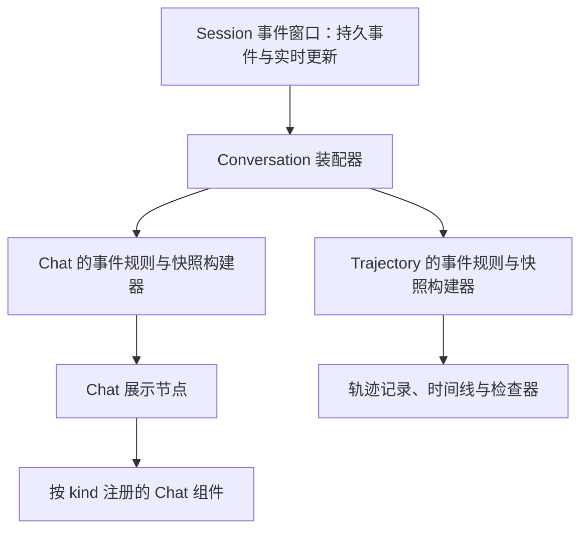

# DSH 参考：轨迹、会话装配与 Chat 展示

> 状态更新：本文保留审查阶段的基线分析（`edebdae`）。2026-09-05 已在独立工作树实施第一轮对话契约修复；当前改动、验证与未完成事项见 [实现记录](conversation-implementation-2026-09-05.md)。下文的缺陷描述和“未改产品代码”指审查阶段。

审查日期：2026-09-05。参考仓库：[deepseek-ai/deepseek-harness](https://github.com/deepseek-ai/deepseek-harness)。

本次源码固定在 `d347e703908d0406b7a7ef80e3a0e594d86b2215`，提交时间为 2026-09-04。通过 GitHub 搜索定位项目，再读取该提交的文档和相关源码。只做静态审查，未安装、运行或验证 DSH 的实际界面。

## 1. 与用户目标直接对应的设计

**DSH 将 Chat 与 Trajectory 作为两个独立的展示目标，共同读取 Session 事件窗口，各自生成展示数据。** Trajectory 的实现说明明确其不会读取或修改 Chat 快照；两者都经过自己的事件投影。这个边界支持用户提出的“执行时间轴、轨迹不能直接决定对话展示”。[Trajectory 说明](https://github.com/deepseek-ai/deepseek-harness/blob/d347e703908d0406b7a7ef80e3a0e594d86b2215/packages/client/ui-trajectory/README.md)

代码链路可归纳为：

两条路径共享 Session 绑定，不额外打开第二个事件源。Conversation 本身提供不依赖 React 的装配规则注册表和目标快照注册表；具体展示包注册自己的规则和视图。[Conversation 包职责](https://github.com/deepseek-ai/deepseek-harness/blob/d347e703908d0406b7a7ef80e3a0e594d86b2215/packages/client/ui-conversation/README.md)

## 2. 可借鉴的四个具体机制

| DSH 的实现 | 对 marloues 的启示 |
| --- | --- |
| `ConversationNodeDefinition` 用 match/start/update/buildViewNode 分开识别、积累状态和生成展示节点 | 原生事件映射与展示装配各有责任；不能让 React 逐条理解 Runtime 输出 |
| 工具规则按 callId 关联开始和结果，子调用归属同一根调用 | 一次工具活动可对应多条轨迹，完成后更新原条目；保留因果关系 |
| ChatSnapshotBuilder 管理稳定节点、可见顺序和增量 upsert | 内容变化只更新对应节点，结构变化才调整顺序；有利于流式和展开状态稳定 |
| ChatNodeSeat 按节点 kind 路由到注册组件 | 现有 18 个组件由宿主展示契约驱动；新增 Runtime 无需重写组件选择逻辑 |

源代码：[事件到节点的契约](https://github.com/deepseek-ai/deepseek-harness/blob/d347e703908d0406b7a7ef80e3a0e594d86b2215/packages/client/ui-conversation/src/client/contract/conversation.ts#L185)、[工具活动聚合](https://github.com/deepseek-ai/deepseek-harness/blob/d347e703908d0406b7a7ef80e3a0e594d86b2215/packages/client/ui-chat/src/client/conversation-nodes/tool.ts#L232)、[Chat 快照构建](https://github.com/deepseek-ai/deepseek-harness/blob/d347e703908d0406b7a7ef80e3a0e594d86b2215/packages/client/ui-chat/src/client/conversation-nodes/chat-snapshot-builder.ts#L960)、[组件分发](https://github.com/deepseek-ai/deepseek-harness/blob/d347e703908d0406b7a7ef80e3a0e594d86b2215/packages/client/ui-chat/src/client/chat/ChatNodeSeat.tsx#L140)。

这里的最终 Chat 页面仍会遍历节点顺序。关键在于它遍历的是装配完成的 Chat 节点，而非原始日志或未经展示契约处理的中间 items。[真实 Chat 入口](https://github.com/deepseek-ai/deepseek-harness/blob/d347e703908d0406b7a7ef80e3a0e594d86b2215/packages/client/ui-chat/src/client/chat/ChatView.tsx#L207)

## 3. 折叠体验也由完整回合语义决定

DSH 的 Compact 模式默认在运行中展开过程，回合结束后，仅在最后 Step 具有可见回答且没有工具调用块时，才将它作为最终答复边界并折叠前面的过程。没有最终答复的已结束回合继续展示过程；错误、用户输入等保留独立位置，历史未加载完整时也不会提前隐藏过程。这些规则比“取最后一条非空文字作为总结”多了必要的语义判断。[Chat 折叠规则](https://github.com/deepseek-ai/deepseek-harness/blob/d347e703908d0406b7a7ef80e3a0e594d86b2215/packages/client/ui-chat/README.md#turn-process-folding)

对 marloues 的建议是把这类条件写进用户既有的展示契约和验收场景。保留 Runtime 提供的明确消息角色；未提供的部分按已声明规则处理。具体哪些信息折叠、哪些结果独立展示，继续由宿主契约决定。

## 4. 可插拔边界的借鉴范围

DSH 的 Agent 接口与具体 agent-loop 分包，接口包不依赖 loop；具体实现注册工厂后，UI 和其他消费者通过统一 Agent handle 工作。这与“以后自行实现 Runtime，体验保持一致”有对应关系。[Agent 接口与实现边界](https://github.com/deepseek-ai/deepseek-harness/blob/d347e703908d0406b7a7ef80e3a0e594d86b2215/packages/core/agent/README.md)

但 DSH 自身管理 Agent loop 和模型消息历史；这次查看的源码不足以证明它已经将 Claude Code、Codex 等完整 Runtime 按 marloues 的目标等价接入。对 marloues 应借鉴接口和投影边界，继续让各原生 Runtime 管理自己的执行循环、上下文及原生会话，宿主保存运行关联和展示所需的规范化事实。原生能力优先、缺失能力才评估 Patch 的规则保持不变。

## 5. 对现有修复方案的具体调整

1. **固定宿主语义契约**：收敛现有 WorkflowTurnItem/回合状态，修复消息角色与生命周期 phase 混用；Adapter 负责原生语义映射，保留稳定 ID、调用关系和来源引用。
2. **明确唯一展示入口**：用已有 TurnPresentationModel 承担对话展示装配；TurnView 消费装配结果，接回专用组件、活动组、正文及结果。它不能再次从原始列表自行猜最终答复。
3. **独立处理轨迹查看**：原始记录服务于诊断、时间线和追溯。若产品提供轨迹页，它拥有自己的投影，不从 Chat 组件反推执行历史，也不改变 Chat 状态。
4. **约束更新与身份**：实时更新、完成快照和历史回放映射到同一宿主 item 身份；只因内容变化，不应重新生成节点身份或整段重挂载。
5. **验收完整装配路径**：从各 Adapter 的 fixture 到真正的 TurnView 验证同一语义结果；改变 chunk 数量、重复投递或包装事件，最终展示应一致。加上无最终答复、审批、中断、历史缺页和回放场景。

以上是对现有模块的责任收敛建议，可先用静态规则和类型映射落地；是否采用 DSH 的 Cordis 动态注册体系另行按实际扩展需求评估。

本次搜索还找到社区项目 [DamonBao/dsh-codex-suite](https://github.com/DamonBao/dsh-codex-suite)，其 Conversation UI 插件描述了 Codex 风格的回合折叠与结果展示。它与官方 DSH 是不同项目；本报告的架构结论以上述固定提交的官方源码为依据。

相关材料：[对话渲染审查](/Users/xuzong/workspace/marloues-architecture-review-20260905/docs/architecture/codex-rendering-review-2026-09-05.md)、[Runtime 可插拔方案](/Users/xuzong/workspace/marloues-architecture-review-20260905/docs/architecture/runtime-pluggability-review-2026-09-05.md)。
