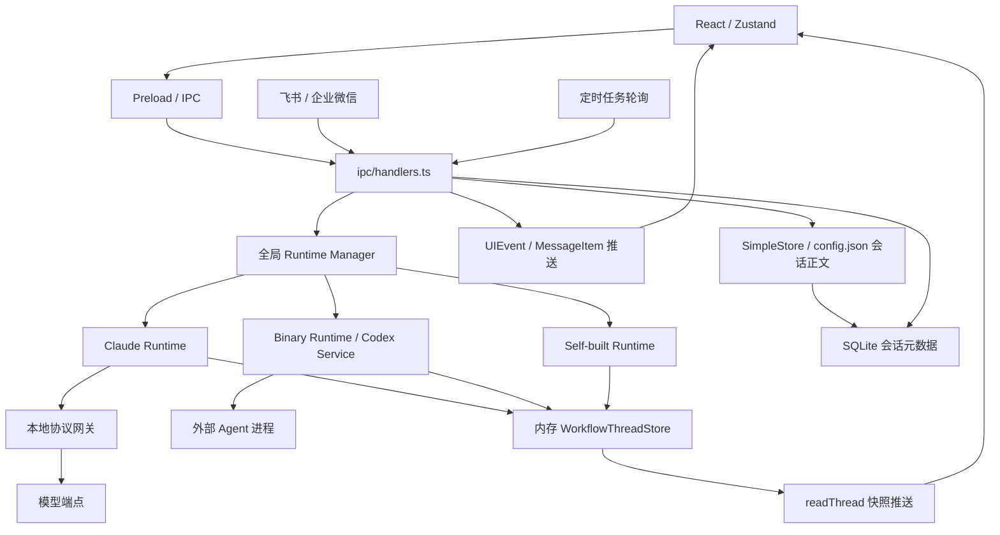
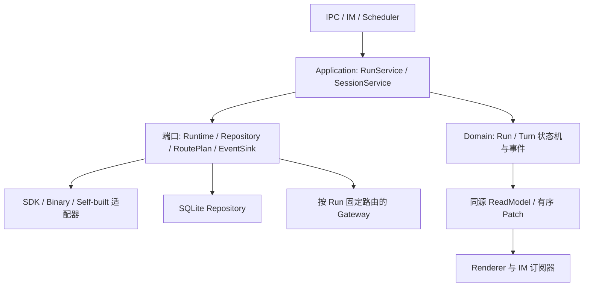

# Marloues 架构审查与改进方案

> 状态更新：本文保留审查阶段的基线分析（`edebdae`）。2026-09-05 已在独立工作树实施第一轮对话契约修复；当前改动、验证与未完成事项见 [实现记录](conversation-implementation-2026-09-05.md)。下文的缺陷描述和“未改产品代码”指审查阶段。

审查日期：2026-09-05。基线：`edebdae45ce19f787125584750e636f56ecb30d3`，应用版本 `0.3.4`。

审查分支：`codex/architecture-review-20260905`。

独立 worktree：`/Users/xuzong/workspace/marloues-architecture-review-20260905`。

## 结论

经用户明确，产品主线是：**前期接入现有 Runtime 并稳定执行任务，未来接入自研 Runtime，保持统一产品体验；以能力接口和每个 Runtime 的 Adapter 实现插拔，原生能力优先，缺失能力再评估可选 Patch。**

据此，架构审查首先要判断能力契约是否完整、Adapter 是否真正委托原生能力、Patch 是否有明确边界，以及新增 Runtime 是否需要修改 UI 和业务编排。[针对可插拔目标的补充审查与能力设计](/Users/xuzong/workspace/marloues-architecture-review-20260905/docs/architecture/runtime-pluggability-review-2026-09-05.md) 是当前改造主线，包含新发现的 Binary fork 原生接口未接通问题。

用户进一步明确要沿用逆向 Codex 得到的 18 个组件及其渲染体验。[对话渲染专项审查](/Users/xuzong/workspace/marloues-architecture-review-20260905/docs/architecture/codex-rendering-review-2026-09-05.md) 已定位真实页面绕过原展示模型、10 类助手侧内容未渲染、最终答复选择错误，以及消息语义 phase 在转换中丢失的问题，并给出复用现有组件的接回方案。

用户确认：Adapter 的消息列表是执行时间轴和轨迹，不应直接决定对话页面。方案必须将原生轨迹、宿主回合状态与展示模型分开，按用户既有契约驱动组件；恢复某个旧入口只是其中一步。

下面七项是执行稳定性与宿主基础设施问题，仍然成立。其共同原因是**宿主执行过程没有统一的生命周期所有者，应用会话状态也没有唯一且完整的持久化来源**。全局配置、Runtime 实例、IPC handler、内存投影和 JSON 存储分别管理部分状态，跨模块边界处出现实际错误。

建议保留现有 Electron + React + TypeScript 技术栈，围绕能力接口逐步收敛模块。文中 RunService 管理宿主侧请求、取消、订阅和任务结果，Runtime 继续管理自己的原生执行循环与上下文；SessionRepository 保存应用索引和展示投影，原生会话状态继续由对应 Runtime 管理。

| 编号 | 优先级 | 问题与实际影响 | 建议落点 | 证据强度 |
| --- | --- | --- | --- | --- |
| F1 | P1 | 持久化会话被当成缓存裁剪，默认第 51 个会话挤掉旧会话，包括置顶会话 | SessionRepository；事务存储与独立缓存 | 隔离执行原类复现 |
| F2 | P1 | 网关重新读取全局配置，同一任务后续请求可能切换供应商和模型 | 每个 run 固定 RoutePlan | 隔离执行原路由回调复现 |
| F3 | P1 | 定时任务把“已开始”记为“成功”；任务执行还要求窗口存在 | RunService、ScheduleRunner、窗口订阅器 | 原函数探针 + 启动调用链 |
| F4 | P2 | Runtime 实例级回调承载会话事件，并发时存在串会话窗口 | RunContext；按 run 订阅与释放 | 静态调用链确认，未做真实 SDK 并发复现 |
| F5 | P2 | 实时、落盘、恢复分别推导状态，失败回合恢复后变成 completed | 统一 Turn 状态与投影 reducer | 原恢复逻辑复现 |
| F6 | P2 | 底层支持分页，但 IPC 不传游标，100 轮以前历史无法继续加载 | 完整 ReadThreadRequest 契约 | 原 slice、读取函数和 serializer 联合复现 |
| F7 | P2 | 核心依赖成环，IPC 集中编排多个业务域，修改和测试边界不稳定 | 应用装配层、端口注入、依赖约束 | TypeScript 静态依赖图 + 源码 |

P1 表示建议在下一次功能发布前处理的数据完整性、请求目的地或任务结果正确性问题；P2 表示后续迭代应处理的可靠性和模块演进问题。这是修复排序，不是生产事故或漏洞利用的断言。

## 1. 当前架构与审查范围



图中省略权限、MCP、Skills、终端、浏览器和更新支线，突出本次发现最集中的执行与状态链路。`site/` 是独立 Astro 官网，不在桌面任务的核心数据路径内。

规模统计来自 Git 跟踪的 `.ts/.tsx/.js/.jsx` 文件，含注释与空行，不含依赖和构建产物：

| 区域 | 文件数 | 行数 | 主要职责 |
| --- | ---: | ---: | --- |
| `client/main` | 145 | 44,851 | Runtime、IPC、服务、网关、数据库、IM |
| `client/preload` | 1 | 505 | Renderer 能力接口 |
| `client/shared` | 35 | 6,932 | 类型、事件协议、转换器 |
| `client/renderer` | 298 | 47,640 | 页面、状态仓库、消息展示 |

重点阅读了应用启动、Runtime Manager、三种 Runtime 的关键生命周期、网关路由、会话存储、定时任务、readThread 与 renderer 消费链，并检查相关测试、CI、构建配置及架构文档。没有逐行审完全部业务代码，也没有执行真实供应商、IM、打包客户端或 Electron E2E；安全部分只是边界检查。

已有设计值得保留：`AgentRuntime` 能力接口、请求级 `settingsSnapshot`、工作区 MCP 策略、纯协议转换器、SQLite WAL、readThread 推送合并器、renderer 缓存限制及现有测试。后续修复应把这些已有边界贯穿到消费者。

## 2. 具体问题与解决方案

### F1 / P1：持久化会话与缓存淘汰混在一起

**证据**：[SimpleStore.saveSession](/Users/xuzong/workspace/marloues-architecture-review-20260905/client/main/store.ts:294) 在保存时把 `sessions` 截成 `maxSessions`，默认值为 50；随后只向 SQLite 写入该会话的元数据。[flush](/Users/xuzong/workspace/marloues-architecture-review-20260905/client/main/store.ts:226) 将整个对象同步覆盖到 JSON。重命名等方法也没有统一经过元数据更新路径。

**复现**：向原 `SimpleStore` 类注入内存文件系统，保存 51 个会话，并把第一个设为置顶。重新加载后只有 50 个正文，第一个已不在 JSON 中，元数据依赖却收到 51 条记录。此探针没有创建或删除任何真实会话。

**影响**：限制缓存数量会直接影响应用自身保存的历史；置顶不构成保留保护。部分 Runtime 的原生日志可能仍保留内容，但当前应用存储不能保证恢复。JSON 正文和 SQLite 元数据的写入还不能作为一个事务成功或失败。直接覆盖 JSON 带来的崩溃损坏风险属于代码推断，本次未进行崩溃注入。

**方案**：

1. 先取消持久化正文的自动 `slice`；历史保留策略单独定义，默认保留，并提供可见的归档/导出流程。
2. 提取 `SessionRepository`，将应用侧 session、turn、message/item 投影统一到 SQLite；保存展示消息与更新元数据在同一事务完成。保存 Runtime ID 与原生 thread ID 映射，原生上下文和恢复数据继续由 Runtime 管理。
3. JSON 迁移必须可重复执行：保留原文件备份，以稳定 ID 导入、校验数量和内容，再标记迁移完成。切换后明确唯一写入来源，避免长期双写。
4. renderer 的 LRU 和列表分页只限制内存与读取量。大附件以文件或 artifact 引用存储，避免正文中重复内嵌。

事务提供“整批提交或不提交”的边界；这种保证不能由先写 SQLite、再延迟写 JSON 组成。[SQLite 原子提交说明](https://www.sqlite.org/atomiccommit.html)

**验收**：保存并重启 200 个含置顶、归档、跨工作区会话，正文和元数据一致；迁移重复执行不新增重复记录；在写入中断的测试中，数据保持完整的旧版本或新版本。

### F2 / P1：网关越过了任务配置快照

**证据**：[sendChatTurn](/Users/xuzong/workspace/marloues-architecture-review-20260905/client/main/ipc/handlers.ts:1800) 为本轮构建配置快照；[ClaudeRuntime.sendMessage](/Users/xuzong/workspace/marloues-architecture-review-20260905/client/main/core/runtime/claude-runtime.ts:1235) 使用该快照计算路由。但是进入[网关 resolveRoute](/Users/xuzong/workspace/marloues-architecture-review-20260905/client/main/gateway/index.ts:54) 后，传入模型被命名为 `_model` 而未使用，路由再次从 `getAgentSettings()` 计算。

**复现**：原回调在全局配置 A 下将 `model-a` 路由到 A；全局配置改为 B 后，同一个 `model-a` 请求被路由到供应商 B、模型 B。使用虚构端点和密钥，未发出网络请求。

**触发范围**：经协议网关的请求。直连路由不经过这个回调。一个多次调用模型的任务运行期间更改默认模型/供应商，就可能触发；不需要假设存在项目级模型覆盖。

**影响**：同一任务的实际供应商、模型、费用归属和上下文目的地可能与启动时的快照不一致。对需要固定企业端点的使用场景尤其重要。

**方案**：启动任务时由应用层生成不可变 `ResolvedRunConfig`，其中包含完整 `RoutePlan`、供应商、模型、配置版本与凭据引用。网关凭任务专用的本地 token/opaque route ID 查找已注册的 plan；所有重试和协议转换使用同一 plan。任务结束后释放注册项。凭据解析留在主进程；只依赖 `model` 字符串不足以区分不同供应商的同名模型。

**验收**：A 任务运行中切换默认配置到 B，A 的后续调用与重试仍去 A，新任务去 B；两个供应商使用同名模型也不会串路由；测试同时覆盖直连和网关路径。

### F3 / P1：缺少独立于 UI 的任务生命周期

**证据**：[sendChatTurn](/Users/xuzong/workspace/marloues-architecture-review-20260905/client/main/ipc/handlers.ts:1764) 要求存在主窗口，使用 `void (async () => ...)()` 启动执行，然后返回 `started` 回执。[executeScheduledTask](/Users/xuzong/workspace/marloues-architecture-review-20260905/client/main/ipc/handlers.ts:2550) 只等待这个回执，立即调用 `finishScheduledTaskRun(..., "success")`，没有等待回合终态。

另有明确的启动顺序问题：[index.ts](/Users/xuzong/workspace/marloues-architecture-review-20260905/client/main/index.ts:417) 先注册 handler、后创建窗口；handler 注册时立即启动一次定时任务轮询。此时已到期任务会走 `no_window`。一次性任务在[markScheduledTaskAfterRun](/Users/xuzong/workspace/marloues-architecture-review-20260905/client/main/services/schedule-service.ts:379) 中无论结果都会禁用。macOS 关闭最后一个窗口但保留应用运行时，也存在同一窗口依赖。

**复现**：原调度函数只接收到 `started` 即记录 success；原发送函数在 Runtime 存在而窗口不存在时返回 `no_window`。启动链路通过静态追踪确认，未启动真实 Electron 复现。

**方案**：提取 `RunService`，将“接收任务”与“任务完成”明确分开：

```ts
interface RunHandle {
  runId: string;
  completion: Promise<RunOutcome>;
  cancel(reason?: string): Promise<void>;
}
// UI/IM/调度器调用同一入口；Window 只订阅状态。
startRun(request: RunRequest): Promise<RunHandle>;
```

用持久化状态机表达 `queued → running → succeeded / failed / cancelled / interrupted`。调度器在接收回执后保存 `runId`，在真实终态提交结果；每个任务增加在途锁/租约和重启恢复规则。不能只把调度循环改成串行等待全部 completion，否则一个长任务会阻塞其他任务的调度。

短期可先让首次轮询发生在初始化完成之后，并区分 `accepted` 与 `success`；完整修复仍需要让 Runtime 执行脱离窗口。事件推送失败不能阻止结果落盘。

**验收**：任务接受后异步失败时，run 记录必须是 failed；关闭或重建窗口时后台任务继续且结果可恢复；启动时已到期的一次性任务正常执行；重启后遗留 running 状态不会永久悬挂或重复执行。

### F4 / P2：会话级数据放在 Runtime 全局槽位

**证据**：[AgentRuntime.forwardDeferredEvent](/Users/xuzong/workspace/marloues-architecture-review-20260905/client/shared/agent-runtime.ts:192) 是实例级单一回调；每个新回合由 [handler](/Users/xuzong/workspace/marloues-architecture-review-20260905/client/main/ipc/handlers.ts:2164) 覆盖。[ClaudeRuntime](/Users/xuzong/workspace/marloues-architecture-review-20260905/client/main/core/runtime/claude-runtime.ts:1725) 在结束时才读取当前槽位，并在延迟查询完成后清除它。

**触发顺序**：A 开始设置回调 A → B 开始覆盖为回调 B → A 到达结束边界读取回调 B → A 的延迟 context-usage 进入 B 的闭包。转换器使用传入的 `sessionId/turnId` 建立 UI 事件，因此可能把 A 的 usage 标到 B；后续清理还可能让 B 没有自己的延迟事件回调。内存 thread store 的直接更新仍使用 A 的 ID，并不意味着所有状态都同时串错。

这是静态可推导的并发缺陷；现有测试只覆盖一个回合的延迟事件，本次没有真实 SDK 并发复现。

同一责任归属问题也出现在 [Runtime Manager](/Users/xuzong/workspace/marloues-architecture-review-20260905/client/main/core/runtime/manager.ts:166)：切换和销毁管理全局实例，取消请求则查找当前实例。设置页已有停止任务后切换的交互，但核心生命周期仍依赖 UI 配合。

**方案**：将回调作为 `startRun`/`sendMessage` 的请求级依赖，在任务创建时捕获；事件 envelope 强制携带 `runId/sessionId/turnId/sequence`。用 `RuntimeLease` 或 run→runtime 映射定位取消和审批目标，由主进程串行管理切换、排空和销毁。第一步不必改变“全局选择当前内核”的产品行为。

**验收**：A/B 并发、逆序结束、延迟查询乱序返回，事件归属正确且恰好一次；运行时切换与取消并发时，取消一定落到所属实例；一个任务结束不能解除另一个任务的订阅。

### F5 / P2：实时与历史恢复缺少同一个状态模型

**证据**：Runtime 更新 `WorkflowThreadStore`，handler 同时独立积累 `MessageItem`、推送 UI 事件并写 JSON；renderer 又维护 legacy 消息与 readThread 快照。[RehydratableMessage](/Users/xuzong/workspace/marloues-architecture-review-20260905/client/main/core/runtime/workflow-thread-store.ts:24) 不包含持久化消息的 status，恢复时[根据内容是否为空推断状态](/Users/xuzong/workspace/marloues-architecture-review-20260905/client/main/core/runtime/workflow-thread-store.ts:638)。

**复现**：持久化 `status: "failed"` 且带错误文本的 assistant 消息，经过原恢复逻辑后得到 `status: "completed"`、`error: null`。这不是单纯字段命名差异：重启前后的回合语义已经改变。

**方案**：先补齐持久化 Turn 的稳定 ID、显式终态、错误与时间字段，恢复时忠实读取。随后选定一个 canonical 展示 Turn 模型，由应用层 reducer 唯一推进投影；Adapter 归一化原生事件，UI 和 IM 从同一投影派生。执行终态取自 Runtime，宿主维护自己的接收/失联等状态；原生执行和上下文状态仍由 Runtime 管理。兼容适配器保留在边界并设定退出条件。

不要求立刻引入完整 event sourcing。可以先采用 SQLite Turn 快照 + 必要事件序号，解决状态恢复、幂等和乱序，再按诊断需要增加事件日志。

性能方面，已有 100 ms 快照合并器与 renderer batcher，不能归结为“没有节流”。不过完整快照仍与 item 事件并存。建议测量主进程事件循环延迟、IPC 字节数和长会话渲染成本，再把热路径收敛到有序 patch；快照用于初始化与重新同步。Electron 官方也建议先测量，并避免在主进程执行耗时 CPU 工作和阻塞 I/O。[Electron 性能指南](https://www.electronjs.org/docs/latest/tutorial/performance)

**验收**：同一录制事件序列经实时消费、落盘重启、回放得到等价的 Turn；failed/cancelled/interrupted 不会恢复成 completed；重复或乱序事件不会重复追加内容。

### F6 / P2：分页契约在 IPC 边界丢失

**证据**：[serializer](/Users/xuzong/workspace/marloues-architecture-review-20260905/client/main/core/runtime/read-thread-serializer.ts:51) 实际支持 `cursor/limit`，但 [preload](/Users/xuzong/workspace/marloues-architecture-review-20260905/client/preload/index.ts:287) 与[共享接口](/Users/xuzong/workspace/marloues-architecture-review-20260905/client/shared/types.ts:1361) 只接受 `sessionId`。[主进程](/Users/xuzong/workspace/marloues-architecture-review-20260905/client/main/ipc/handlers.ts:252) 固定读取前 100 轮；[loadMoreReadThread](/Users/xuzong/workspace/marloues-architecture-review-20260905/client/renderer/src/stores/chat-slices/readthread-slice.ts:100) 重复同一个请求。

**复现**：构建 101 轮历史，执行一次初始加载、两次加载更多，始终返回 100 轮且 `hasMore=true`。直接给底层 serializer 传 `cursor="100"` 则能得到剩余一轮。

**方案**：将 `ReadThreadRequest { sessionId, cursor?, limit? }` 贯通 shared→preload→IPC→repository；renderer 按返回顺序与稳定 turn ID 合并。应同时处理快照推送替换已加载旧页的问题。短期接通现有 offset cursor，后续有持续新增回合时使用稳定键游标或 snapshot revision，避免翻页期间偏移变化导致重复或漏页。

**验收**：101、250 轮历史能读取到最早一轮，最后一页 `hasMore=false`；翻页同时新增回合不重不漏；实时快照不会丢掉已经加载的旧页。

### F7 / P2：模块依赖存在真实循环，编排层被放进 IPC

**证据**：`handlers.ts` 为 3,813 行，包含 121 个 `ipcMain.handle`、4 个 `ipcMain.on`、49 条运行时静态 import。文件同时承担聊天执行、消息转换、审批分发、IM 桥接、调度和存储。问题是这些职责的共同变更与失败边界，行数只是定位信号。

以 TypeScript 转译去掉类型导入后，静态 import/export 图中检测到 4 个多节点强连通分量：

| 依赖环 | 节点数 | 直接原因 |
| --- | ---: | --- |
| Runtime Manager → ClaudeRuntime → MCP Service → Runtime Manager | 3 | Runtime 写 MCP 状态，MCP Service 又反查全局 Runtime |
| Workspace Service ↔ Skill Service | 2 | 工作区准备 Skill 缓存，Skill 枚举反查工作区 |
| Settings 内部组件 ↔ 顶层 barrel/页面/Workbench | 13 | 内部叶子组件从聚合出口导入基础组件 |
| Workflow chat barrel ↔ turn presentation/layout helpers | 6 | 底层 helper 反向依赖聚合出口 |

示例入口：[manager.ts](/Users/xuzong/workspace/marloues-architecture-review-20260905/client/main/core/runtime/manager.ts:18)、[claude-runtime.ts](/Users/xuzong/workspace/marloues-architecture-review-20260905/client/main/core/runtime/claude-runtime.ts:39)、[mcp-service.ts](/Users/xuzong/workspace/marloues-architecture-review-20260905/client/main/services/mcp-service.ts:10)。扫描不包含动态 import/require，不能据此断言除此以外完全无环。现有循环也不等于已经发生启动失败。

**方案**：

1. `main/application` 管理 Run、Session、Schedule、Extension 的用例编排；IPC、IM、Timer 仅作入口适配器。
2. Runtime 注入 `McpStatusReporter`、`ToolCatalog` 等窄接口；由应用服务查询 Runtime，避免 MCP Service 反向获取全局实例。
3. 工作区用例调用 Skill 缓存准备服务，Skill 本身接受显式 workspace 输入。
4. 组件内部直接依赖叶子基础组件，聚合出口只供外部消费者使用。
5. 增加依赖约束：domain/shared 不依赖 Electron、React、具体 Runtime 或 services；模块内部不能反向导入本模块的聚合入口。按“禁止新增环→逐步清理已有环”的顺序接入 CI。

**验收**：先解除两组 main 环和两组 renderer 环；运行用例无需构造 BrowserWindow；IPC handler 只做校验、调用用例、序列化返回；新 Runtime 接入只需实现端口与注册，不修改核心业务流程。

## 3. 目标模块边界



这里表示模块责任边界，不是新增操作系统进程。建议目录：

```text
client/shared/contracts/       IPC 与事件的版本化数据结构
client/main/domain/            Run、Turn、Session 不变量和 reducer
client/main/application/       用例编排、调度生命周期、配置快照
client/main/ports/             Runtime、Repository、EventSink 等接口
client/main/adapters/          逐步承接现有 runtime、gateway、SQLite 实现
client/main/ipc/               按领域注册 channel、验证请求、返回 DTO
client/renderer/src/           消费只读投影、管理交互状态
```

迁移以职责为单位，保留旧路径转发适配；不应先把文件统一搬家再寻找边界。终端和嵌入浏览器继续作为宿主能力，通过权限端口注入执行链。

IPC 还应统一 sender/frame 校验和输入 schema 校验，避免每个 handler 自行决定边界。当前 preload 已按能力封装，主窗口也有导航策略；本次没有证明可利用的远程执行链。[Electron 关于 IPC sender 校验的说明](https://www.electronjs.org/docs/latest/tutorial/security#17-validate-the-sender-of-all-ipc-messages)

## 4. 建议实施顺序

以下按依赖排序，每一步都能独立验证；不是工期承诺。

| 阶段 | 交付 | 关联问题 | 放行条件 |
| --- | --- | --- | --- |
| 1：修正现有行为 | 保留全部会话；固定网关任务路由；区分 accepted 与终态；补齐分页与状态恢复 | F1/F2/F3/F5/F6 | 将探针场景改写为期望正确行为的回归测试 |
| 2：抽取执行用例 | RunService、RunHandle、窗口事件订阅器、请求级回调、Runtime 切换排空 | F3/F4/F7 | 无窗口执行、A/B 并发、异步失败、取消与切换测试通过 |
| 3：统一持久化 | SessionRepository、SQLite Turn/message、备份和幂等迁移 | F1/F5 | 迁移校验、重启恢复、写入中断测试通过 |
| 4：统一读模型 | canonical reducer、带序号的 patch、稳定分页、兼容适配退出 | F5/F6 | 实时/回放/重启等价，长历史无漏页；性能结果与基线比较 |
| 5：固化边界 | 清理依赖环、IPC 统一验证、架构约束进 CI、更新 ADR | F7 | 禁止新增反向依赖，原有功能与打包路径回归通过 |

阶段 1 可以采用小补丁止住现有错误；阶段 2–4 再收敛实现。事务性迁移应保留原数据备份和可回退读路径，不进行批量删除。

架构文档也需要同步：[原架构 README](/Users/xuzong/workspace/marloues-architecture-review-20260905/docs/architecture/README.md) 仍出现旧文件名、153 个测试以及 safeStorage 不可用时 Base64 回退等描述；当前实现已经是 653 个测试，且新写入在加密不可用时会报错。应明确历史决策与当前实现，避免后续工作依据过时假设。

## 5. 验证记录与边界

| 检查 | 本次结果 |
| --- | --- |
| 原有单元测试 `npm run test:unit` | 122 个文件，653 个测试通过 |
| `npm run typecheck` | node 与 web 两套 TypeScript 检查通过 |
| `npm run test:layout` | 通过 |
| 新增探针的 ESLint | 通过 |
| `node tests/contract/architecture-review.probe.mjs` | 9 个观察场景均复现，覆盖 F1/F2/F3/F5/F6 及渲染专项 R1/R2/R3 |
| F4、F7 | 调用链与静态依赖检查；不声称已经完成真实并发/E2E 验证 |
| 完整 contract、build、Electron E2E、打包、真实模型/IM | 本次未执行 |

本次复用了原 checkout 已安装的依赖运行基线测试，没有重新安装 lockfile 全量依赖。因此结果代表该本地依赖环境；发布前仍应让 CI 在干净安装环境执行完整质量门。

[离线探针](/Users/xuzong/workspace/marloues-architecture-review-20260905/tests/contract/architecture-review.probe.mjs) 通过 TypeScript AST 提取原函数/类，或装载原模块，在内存依赖下执行。它断言的是“当前缺陷存在”，刻意未接入默认测试命令；修复后应转成期望正确行为的永久回归测试，而不是保留缺陷断言作为质量门。探针没有启动应用、访问外网或读写真实用户数据。

本次只新增审查材料与诊断脚本，没有修改产品实现。上述“方案”和“验收”是后续改造建议，不表示问题已经修复。
