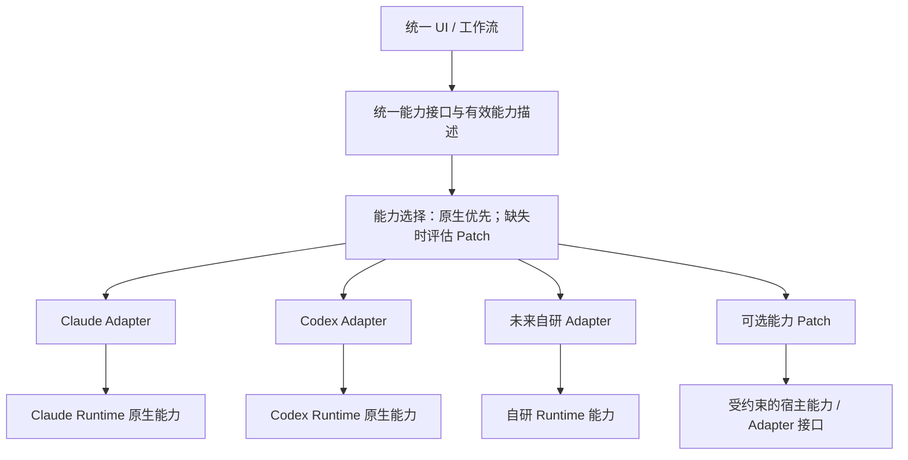

# Runtime 可插拔架构：目标校准与补充审查

> 状态更新：本文保留审查阶段的基线分析（`edebdae`）。2026-09-05 已在独立工作树实施第一轮对话契约修复；当前改动、验证与未完成事项见 [实现记录](conversation-implementation-2026-09-05.md)。下文的缺陷描述和“未改产品代码”指审查阶段。

日期：2026-09-05。代码基线：`edebdae`。本次补充只修改审查文档，未改产品实现。

## 1. 用户明确的目标

前期接入各 Runtime，保证任务稳定执行；未来自行实现一个 Runtime，接入后保持同一套产品体验。由宿主定义能力接口，每个 Runtime 有自己的 Adapter。原生支持的能力使用原生实现；缺失能力再评估 Patch，Patch 可以不提供。任意 Runtime 都应可插拔。

统一产品体验的明确基线是 Codex 对话体验，以及用户此前逆向得到的 18 个组件。能力契约之外，还必须稳定事件语义和展示契约。[渲染专项审查](/Users/xuzong/workspace/marloues-architecture-review-20260905/docs/architecture/codex-rendering-review-2026-09-05.md) 给出原组件被主入口绕过、消息类型丢失和 phase 混用的证据与修复方案。

用户明确的另一条约束是：各 Adapter 的消息列表属于执行时间轴和轨迹；对话 UI 必须按宿主契约展示，不能直接渲染这些列表。Adapter 负责向宿主语义映射，统一回合状态负责承接增量与历史，展示模型负责按契约组装现有组件。新增 Runtime 只改变适配实现，不能改变页面的信息结构。

这意味着验收主线是：**新增一个 Runtime，主要工作应是实现 Adapter、声明能力和注册；已有 UI、业务用例及其他 Adapter 不需要跟着修改。**

## 2. 建议的责任边界



| 模块 | 负责什么 |
| --- | --- |
| 宿主 | 项目与任务索引、统一 UI、应用级策略、请求生命周期、原生 ID 映射、展示投影 |
| 能力契约 | 方法语义、输入输出、事件、错误、终态，以及能力范围和限制 |
| Runtime Adapter | 原生 API 调用、参数与事件转换、能力探测、原生资源创建和释放 |
| 能力 Patch | 为某项缺失能力提供可验证的补齐方案，声明依赖、限制与适用条件 |
| 原生 Runtime | 自己的 Agent loop、上下文、原生 session、执行与恢复机制 |

例如，宿主的 RunService 负责跟踪“请求是否接受、运行是否结束、取消是否完成”；Adapter 调用 Runtime 原生执行和中断能力。未来自研 Runtime 的 Agent loop 可以完全由你实现，再通过同一接口接入。

“体验不变”体现为同一个入口、相同操作语义、稳定事件和展示模型。能力缺失时，以能力描述决定可用、受限或不可用状态。Patch 只有满足相应语义才能宣称支持。

## 3. 现有实现与目标之间的关键缺口

### A1：能力描述不足以驱动原生优先与 Patch 选择

[RuntimeCapabilities](/Users/xuzong/workspace/marloues-architecture-review-20260905/client/shared/agent-runtime.ts:177) 只有布尔字段。相同能力矩阵又在[RuntimeDescriptor](/Users/xuzong/workspace/marloues-architecture-review-20260905/client/shared/types.ts:462)、[Manager 注册表](/Users/xuzong/workspace/marloues-architecture-review-20260905/client/main/core/runtime/manager.ts:66) 和各 Adapter 内重复维护。steer、readThread 等可选方法也没有完整对应的能力描述。

问题不是目前已经证明这些值互相矛盾，而是它们存在多个维护来源；`forkThread: true` 无法表达“原生分支”“复制展示历史”“仅支持最新位置分支”等不同语义。单靠可选方法是否存在也无法说明它在当前版本、会话和权限下能否执行。

建议由每个 Adapter 的 Definition/能力探测提供唯一原生能力来源，组合层据此计算有效能力。例如：

```ts
type CapabilitySupport =
  | { source: "native"; constraints?: CapabilityConstraints }
  | { source: "patch"; patchId: string; constraints?: CapabilityConstraints }
  | { source: "unsupported"; reason: string };
```

这是设计示意，具体约束应按能力分别定义：如 `fork` 是否支持指定消息位置、`cancel` 的粒度、`resume` 的恢复范围。启动探测与必要的会话级判断决定可用性，UI 读取组合后的描述，实际调用仍由主进程验证。

### A2 / P1：存在原生 fork 接口，却没有贯通 Adapter

[CodexService.forkThread](/Users/xuzong/workspace/marloues-architecture-review-20260905/client/main/codex/service.ts:788) 与 [CodexSession.fork](/Users/xuzong/workspace/marloues-architecture-review-20260905/client/main/codex/session.ts:260) 已封装原生 fork 调用；但 [BinaryRuntime.forkThread](/Users/xuzong/workspace/marloues-architecture-review-20260905/client/main/core/runtime/binary-runtime.ts:144) 只复制本地 messages 和 WorkflowThreadStore，未调用该原生接口，能力却声明为 `forkThread: true`。

这直接偏离“原生能力优先”：展示记录的复制并未建立原生分支。当前代码没有在该路径建立新会话到原生 fork ID 的映射；实际分支后继续执行的上下文效果还需要端到端测试。本次结论来自调用链，不声称已运行真实 Codex fork。

[ClaudeRuntime.forkThread](/Users/xuzong/workspace/marloues-architecture-review-20260905/client/main/core/runtime/claude-runtime.ts:1150) 会尝试原生 fork，但失败后返回本地复制结果，返回结构没有区分能力来源与语义降级。

建议先明确 `fork` 的契约，接通已有原生接口并保存原生 ID 映射。缺失原生能力时，可选 Patch 必须独立定义上下文继承方案。原生接口运行失败应返回明确错误，不能一概当成“不支持”并静默复制历史。若 Patch 无法保证真正的上下文继承，就不能把它作为等价 fork 宣称成功。

验收应包含“分支后继续执行”的上下文和分支独立性，而不只是新列表项或消息复制成功；指定位置分支只在版本和接口支持时声明可用。

### A3：Runtime 身份、接入方式和宿主注册耦合

[RuntimeKind](/Users/xuzong/workspace/marloues-architecture-review-20260905/client/shared/types.ts:460) 固定为 `sdk | binary | self-built`；这些值同时承担实例身份和接入方式。协议选择在[provider-routing](/Users/xuzong/workspace/marloues-architecture-review-20260905/client/main/core/config/provider-routing.ts:31) 分支判断，UI 的[展示信息](/Users/xuzong/workspace/marloues-architecture-review-20260905/client/renderer/src/lib/runtime-presentation.ts:10) 又维护一份固定映射。

接入第四个 Runtime、或两个不同的 SDK Runtime 时，就需要修改多处宿主定义。

建议引入稳定的 Runtime ID，把 transport（SDK、process、in-process）作为独立元数据。一个 Runtime Definition 统一提供 ID、展示信息、工厂、协议需求和能力探测入口。宿主从注册表读取描述，配置保存稳定 ID；遗留 ID 通过显式迁移映射兼容。

早期用构建时注册的工厂即可达到模块可插拔。运行时下载插件、动态安装和插件市场可以在需要时再设计。

## 4. Patch 的选择规则

1. 原生能力在当前条件下可用，调用原生实现。
2. 原生能力缺失，检查是否存在显式启用且满足前置条件的 Patch。
3. Patch 也不可用，返回明确 unsupported，并由 UI 展示可用性。
4. 网络、认证、权限、执行失败属于错误处理；只有明确的能力不支持结果才进入能力选择逻辑。重试和替代方案必须保持操作语义和副作用边界。

初期可以使用按能力组合的 wrapper/decorator，无需增加复杂插件框架。每个 Patch 的输入依赖、上下文要求、权限和实现限制都应显式可测，避免分散在 IPC 与 UI 的供应商判断分支中。

## 5. 建议先做的三件事

1. **收敛能力契约和唯一能力描述**：先围绕执行、事件、终态、取消、恢复、fork、steer 定义语义；将 ID、transport 和展示信息分开。
2. **接通原生能力并划清 Patch**：先修复 Binary fork 的 Adapter 调用链，标清 Claude fork 的降级；让普通运行错误与缺失能力走不同处理路径。
3. **用共同契约测试证明可替换性**：同一组场景参数化运行在各 Adapter 上，再接入一个最小测试 Adapter，验证宿主业务/UI 不需要新增身份判断。

共同场景包括：正常完成、启动失败、中断、审批、断线/恢复、双会话并发、原生 fork 后继续运行、缺失能力选择 Patch、Patch 不可用、卸载后的资源释放。每个能力实现只运行自己声明支持的语义测试；宿主统一验证有效能力与 UI 状态一致。

[原审查报告](/Users/xuzong/workspace/marloues-architecture-review-20260905/docs/architecture/review-2026-09-05.md) 中的数据保留、路由漂移、终态和事件归属问题，作为“稳定执行任务”的修复线并行处理。大型存储迁移、目录重组和性能优化按收益逐步推进。
